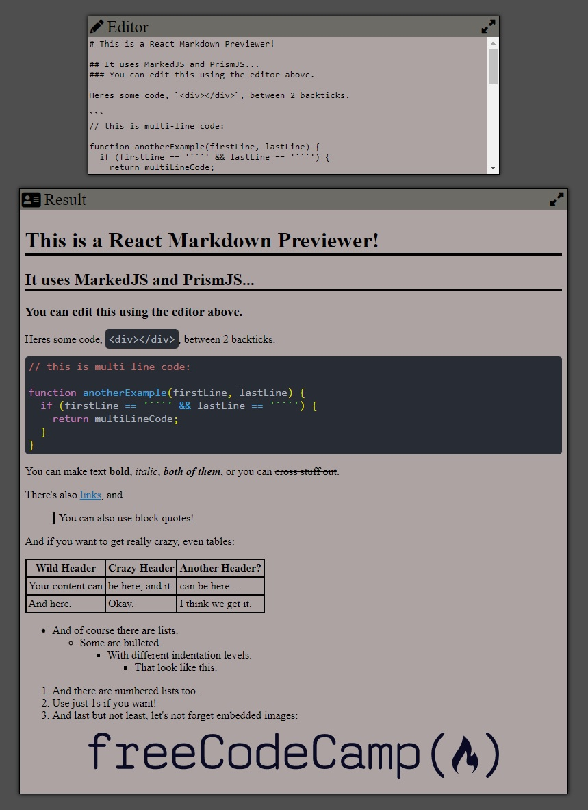

# React Markdown Previewer

- This React application renders a page using markdown text as input.

Technologies used: CSS, Javascript, React

# Live Version



# Running Locally

To run this locally, run the following commands in a terminal:

```
npm install
npm run dev
```

# Requirements

- I can see a textarea element with a corresponding id="editor".
- I can see an element with a corresponding id="preview".
- When I enter text into the #editor element, the #preview element is updated as I type to display the content of the textarea.
- When I enter GitHub flavored markdown into the #editor element, the text is rendered as HTML in the #preview element as I type (HINT: You don't need to parse Markdown yourself - you can import the Marked library for this: https://cdnjs.com/libraries/marked).
- When my markdown previewer first loads, the default text in the #editor field should contain valid markdown that represents at least one of each of the following elements: a heading element (H1 size), a sub heading element (H2 size), a link, inline code, a code block, a list item, a blockquote, an image, and bolded text.
- When my markdown previewer first loads, the default markdown in the #editor field should be rendered as HTML in the #preview element.